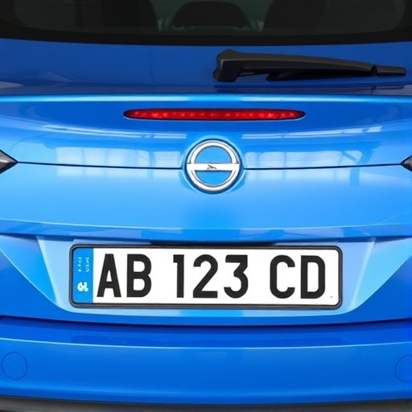

# Third parties

## Sounds

| Sound | Used as | Author(s) | Licence |
| ----- | ------- | --------- | ------- |
| [Error message.wav](https://commons.wikimedia.org/wiki/File:Error_message.wav) | Error message | Versatile Virtuoso | [CC BY-SA 4.0](https://creativecommons.org/licenses/by-sa/4.0/) | si |

## Icons

| Icons | Used as | Author(s) | Licence |
| ----- | ------- | --------- | ------- |
|  | Icon | Giacomo Alessandroni | [CC BY-SA 4.0](https://creativecommons.org/licenses/by-sa/4.0/) |
|  | QRcode scanner |  [Paweł Kuna et al.](https://github.com/tabler/tabler-icons) | [MIT](https://github.com/aws/mit-0) |
|  | Icon | [Triton](https://commons.wikimedia.org/wiki/User:Triton) | [CC BY-SA 4.0](https://creativecommons.org/licenses/by-sa/4.0/) |
|  | Icon | [Ivan A. Krestinin](https://commons.wikimedia.org/wiki/User_talk:Ivan_A._Krestinin) | [CC BY-SA 3.0](https://creativecommons.org/licenses/by-sa/3.0/) |
|  | Icon | [Estoy Aquí](https://commons.wikimedia.org/wiki/User:Estoy_Aquí), Everaldo Coelho and [Rico Shen](https://commons.wikimedia.org/wiki/User:BrockF5) | [GNU LGPL](https://www.gnu.org/licenses/lgpl-3.0.html) | 
|  | Icon | [GregorDS](https://commons.wikimedia.org/wiki/User:GregorDS) | [CC BY-SA 4.0](https://creativecommons.org/licenses/by-sa/4.0/) | 
|  | Icon | [PerfektesChaos](https://commons.wikimedia.org/wiki/User:PerfektesChaos) | [MIT](https://github.com/aws/mit-0) |  
|  | Info | [Isarra](https://commons.wikimedia.org/wiki/User:Isarra) | [PD](https://creativecommons.org/public-domain/) |

## Images
| Image | Used as | Author(s) | Licence |
| ----- | ------- | --------- | ------- |
|  | Example of licence plate | [DeepAI](https://deepai.org/) | [PD](https://deepai.org/terms-of-service/terms-of-service) |  

## Codes

| Code | Used as | Author(s) | Licence |
| ----- | ------- | -------- | ------- |
| [Building Apps with Many Screens](https://ai2.appinventor.mit.edu/reference/other/manyscreens.html) | Open and close a screen | [MIT](https://web.mit.edu/) | [CC BY-SA 4.0](https://creativecommons.org/licenses/by-sa/4.0/) |
